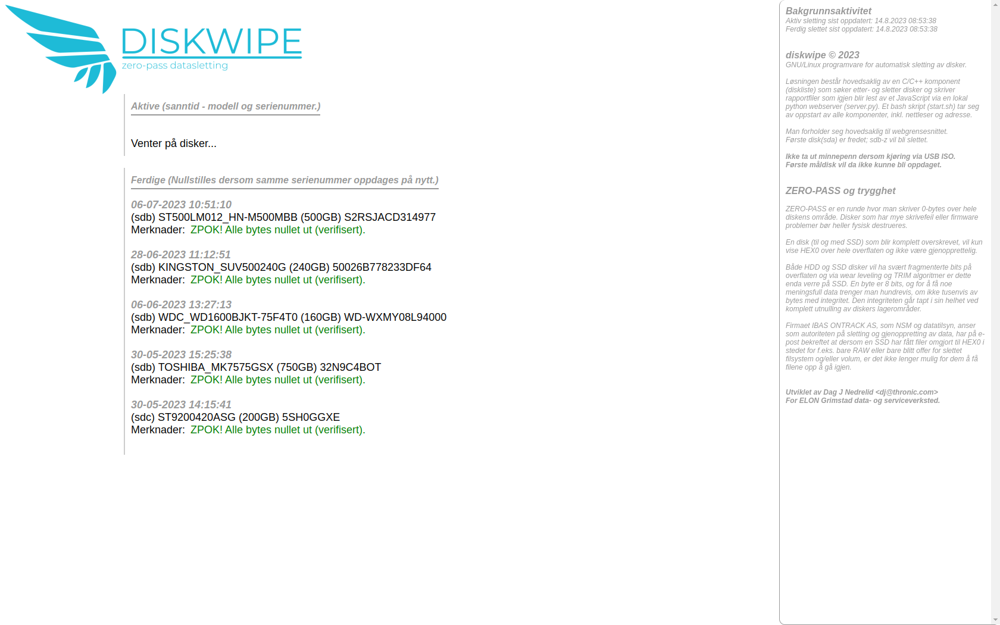
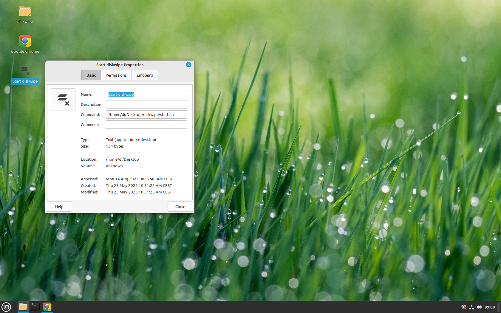
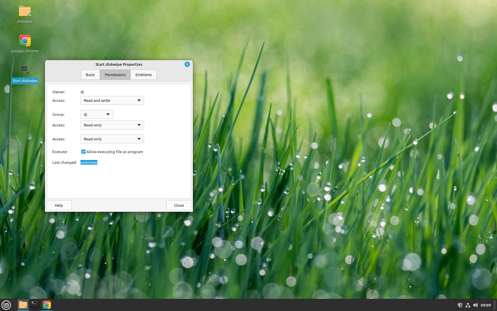
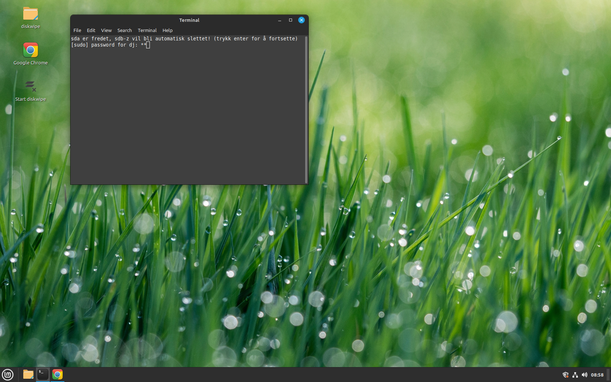
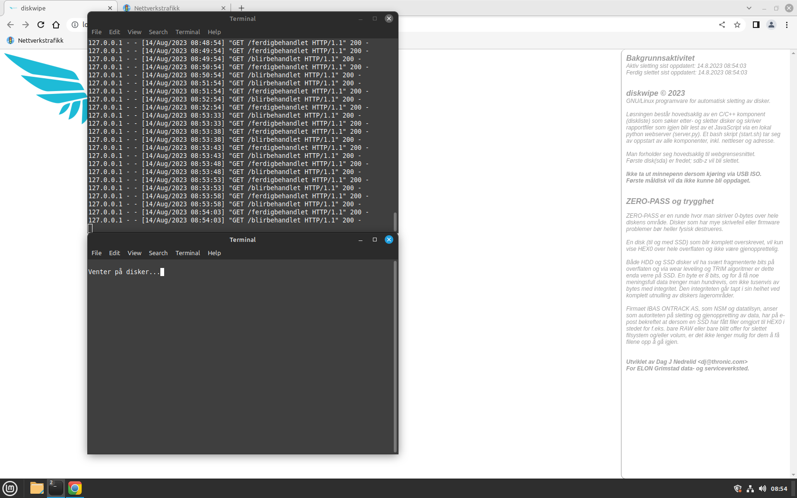

## diskwipe

GNU/Linux programvare for hotswap sletting av disker på sektornivå (utnulling / zero pass).  

En lokal nettside via et python skript viser status for tilkoblede disker og arbeid. Denne oppdaterer seg selv i nærmest sanntid.  
 

Programmet kan kjøres i et ISO miljø som f.eks. SystemRescue, bare tilpass skriptet å bruke terminalen som distribusjonen din
bruker. Jeg bruker Mint Cinnamon som stasjon, så start.sh skriptet er som standard satt til gnome-terminal. Det finnes også en
kommentert linje for xfce4-terminal. Tilpass som nødvendig...  

Dette krever generelt litt teknisk innsikt og forsiktighet i å sette opp.  

Ikke kjør dette på en maskin med viktige data!  

Maskinvaren det kjøres på må ha støtte for SATA hot-swap, noe mange forbukerhovedkort har via AHCI (sjekk i BIOS/evt. kontroller).  

Eksempelbilder av snarveioppsett og oppstart.  

  

  

  

  